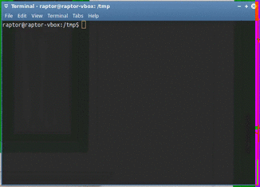

bmst/gif-create
===============

A docker image to convert a movie to a gif, to present things:



It uses internally a python Gimp script to get the best quality, with the minimum size.

Running
-------

```shell
docker run \
    --rm \
    -v /path/to/your/input/file.avi:/tmp/in/test.avi \
    -v /some/writable/folder:/tmp/write \
    -e OUTPUT_FILE_NAME=output.gif \
    bmst/gif-create
```

After chewing a bunch of data, you will get the result as: `/some/writable/folder/output.gif`

Or you can write a [shell script](run.sh):

```shell
#!/usr/bin/env bash

if [[ "$3" == "" ]]; then
    SCALING_FACTOR="1.0"
else # not [[ "$3" == "" ]]
    SCALING_FACTOR="$3"
fi   # else [[ "$3" == "" ]]

echo "Scaling factor is: $3"

docker run \
    --rm \
    -v $1:/tmp/in/test.avi \
    -v $(dirname $2):/tmp/write \
    -e OUTPUT_FILE_NAME=$(basename $2) \
    -e SCALING_FACTOR=$SCALING_FACTOR \
    bmst/gif-create
```

And then run it as:

```shell
run.sh /path/to/your/input/file.avi /somw/writable/folder/output.gif
```

Thanks
------

Inspired from:
 * https://github.com/fgrehm/dotfiles/blob/master/bin/create-gif
 * https://eyeofmidas.wordpress.com/2014/06/03/how-to-record-desktop-images-into-gif-format-on-ubuntu-14-04/


